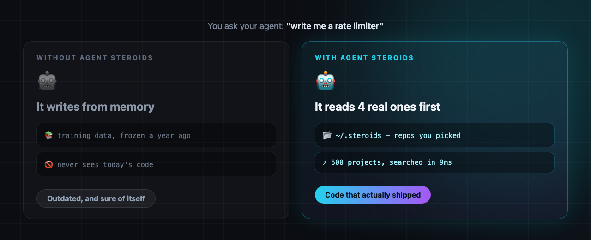
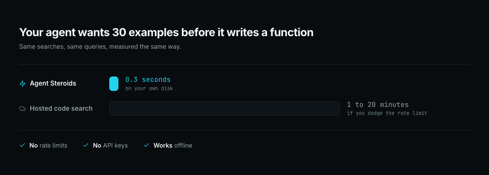

# 💉 Agent Steroids

<p align="center">
  
</p>

<p align="center">
  <strong>Your coding agent writes last year's code. One command fixes it.</strong>
</p>

<p align="center">
  <a href="https://github.com/KenKaiii/agent-steroids"></a>
  <a href="https://www.rust-lang.org"></a>
  <a href="LICENSE"></a>
  <a href="https://youtube.com/@kenkaidoesai"></a>
  <a href="https://skool.com/kenkai"></a>
</p>

<p align="center">
  macOS · Linux · Windows · <a href="#-get-it">one command</a> · no server, no API key, no monthly fee
</p>

---

## 😬 The problem

Your AI learned to code from a snapshot of the internet. **That snapshot is old.**

The libraries kept shipping. New APIs, breaking changes, better ways of doing it. Your agent never saw any of it, so it writes outdated code and sounds completely sure about it.

## 💉 The fix

Real projects, downloaded to your machine. Your agent **reads them before it writes.**

<p align="center">
  
</p>

| | Before | After |
|---|---|---|
| Where its code comes from | a year-old memory | repos updated this week |
| Ask it for a rate limiter | it guesses one | it reads 4 real ones first |
| When it doesn't know | it makes something up | it says so, and finds repos |

## ⚡ Why not a hosted tool?

<p align="center">
  
</p>

| | 💉 Agent Steroids | ☁️ Hosted code search |
|---|---|---|
| One search | **0.009s** | 2s to 40s |
| Rate limit | **none** | hit within minutes |
| Works offline | **yes** | no |
| Costs | **nothing** | account, keys, quotas |
| What it can search | **repos you chose** | whatever they index |

Fine for looking something up once. Useless when your agent wants 30 examples before writing a function, which is exactly what you want it doing.

## 🪶 And it's tiny

| | | |
|---|---|---|
| 40 repos | **145 MB** | fits on a USB stick |
| 500 repos | **1.8 GB** | the entire starter pack |

90% of every repo gets thrown away. No images, no docs, no lock files. Your agent can't read any of that anyway. Only the source it needs is kept.

---

## 🚀 Get it

Needs [Rust](https://rustup.rs). Then:

```bash
cargo install --git https://github.com/KenKaiii/agent-steroids
```

Done. You now have a `steroids` command.

## 🤖 Then let your agent do the rest

Don't set this up yourself. Paste this into [GG Coder](https://github.com/KenKaiii/gg-framework), Claude Code, Cursor, Codex, whatever you run:

```
Install Agent Steroids for me: https://github.com/KenKaiii/agent-steroids

Then look at what I am building and curate a corpus for it:
  - Use `steroids discover` to find well starred, actively maintained repos
    that solve similar problems
  - Add around 20 of them with `steroids add`
  - Show me what you added and how much space it used
```

It reads the docs, installs itself, works out what your project needs, and fills the library.

**Last step.** Paste this into your agent's permanent instructions (`CLAUDE.md`, `.cursorrules`, wherever yours live) so it keeps using it:

```
I have a local corpus of real open source code at ~/.steroids. Search it
before writing anything non-trivial, to see how other projects solved the
same problem.

  steroids search '<regex>' [--tag T] [--repo R] [--language L] [--limit N]
  steroids define <Symbol>       where something is defined
  steroids show <repo> <path> [--from N --to N]   read a file, or one region
  steroids repos                 what is indexed
  steroids recent --tag X        what changed upstream in the last 72 hours

Add --json to search, define or repos for structured output.

If a search says the topic is not covered, that is a gap in my corpus, not a
bad query. Do not retry variations. Instead: run `steroids discover` to find
well starred, actively maintained repos that solve the problem, tell me what
you found and why it fits, and add them once I agree.
```

That's it. No plugin, no server. Your agent calls it the same way it calls `grep`.

## 📦 Or grab 500 repos in one go

```bash
curl -O https://raw.githubusercontent.com/KenKaiii/agent-steroids/main/starter-repos.txt
steroids add --from-file starter-repos.txt
```

TypeScript, Python, Rust, Go, React, Next.js, AI agents, RAG, MCP, databases, DevOps, security, mobile, game dev. Thirty categories. Every repo was checked: not archived, not a fork, committed to within the last year, well starred.

Takes about 25 minutes. Too much? The file is grouped by category with comments, so delete the sections you don't care about. One section is closer to 100 MB and a couple of minutes.

---

## 🎛️ Everything you can do

| Command | What it gets you |
|---|---|
| `steroids` | The full interface. Browse repos, search as you type |
| `steroids add <repo>` | Add a repo. Pasting a GitHub URL works too |
| `steroids index` | Runs by itself after every add, update and remove. `--rebuild` starts the index over |
| `steroids discover 'topic:ai-agents'` | Finds good repos for you. Add `--add` to take them |
| `steroids search '<regex>'` | What your agent calls. Results spread across projects |
| `steroids recent --hours 72` | What these projects shipped in the last 3 days |
| `steroids update` | Pull the latest code. 98 repos in 5.5 seconds |
| `steroids tag --add rust,cli <repo>` | Label repos so your agent can search just a slice |
| `steroids decay` | Auto-drop repos that went quiet. Dry run first |
| `steroids stats` | What it's costing you in disk |

Point it at a USB drive and carry the whole thing between machines:

```bash
STEROIDS_ROOT=/Volumes/MyDrive/steroids steroids search 'retry'
```

<details>
<summary><strong>⚙️ Settings</strong></summary>

```bash
steroids config                  # show everything
steroids config min_stars 500    # change one
```

| Setting | Default | What it does |
|---|---|---|
| `decay_months` | `0` | Drop repos with no commits in N months. 0 means never |
| `decay_archived` | `true` | Also drop repos the owner has archived |
| `auto_discover` | `false` | Top up with new repos on every update |
| `discover_query` | `topic:ai-agents` | What to look for when discovering |
| `discover_limit` | `25` | Cap on how many one discovery run adds |
| `min_stars` | `500` | Skip anything below this |
| `max_age_months` | `24` | Skip repos with no commits in N months. 0 accepts any age |

Decay measures from the repo's **last commit**, not when you added it. A library first published in 2011 but committed to yesterday counts as fresh. Archived repos are dropped whatever their age, since an archive never gets another fix.

Settings live inside the library itself, so they travel with it.

</details>

<details>
<summary><strong>👨‍💻 For devs</strong></summary>

Rust 1.88 or newer. No other dependencies, no runtime, no daemon.

```bash
git clone https://github.com/KenKaiii/agent-steroids.git
cd agent-steroids
cargo install --path .
```

```bash
cargo test --release                       # engine and unit tests
bash tests/commands.sh                     # every command, including failures
cargo clippy --release --all-targets -- -D warnings
cargo fmt
```

`tests/commands.sh` asserts on output *and* exit code, since a command that prints an error and exits 0 looks like success to whatever called it. It needs network access. Some tests need a populated corpus and skip without one:

```bash
STEROIDS_TEST_ROOT=~/.steroids cargo test --release
```

**How it works.** Repos come down as tarballs straight from codeload, which has no rate limit, so a 500 repo ingest is capped by your bandwidth and nothing else. Files are filtered while the download is still streaming, so the full repo never lands on disk. What survives gets compressed against a shared zstd dictionary trained on your own corpus. Search narrows candidates with a non-positional trigram index, then confirms each hit with a real regex, which is why the index costs a fraction of what a normal one would.

`add`, `update` and `decay` make **zero** GitHub API calls. Code comes from codeload, the head commit from git's own protocol, and the last-commit date out of the archive's file timestamps. None of those are rate limited. `discover` is the one exception: GitHub search allows 10 requests a minute without a token. Set `GITHUB_TOKEN` to raise it.

`update` checks each repo's latest commit first and only downloads the ones that moved, so the cost scales with how many repos you have rather than how big they are. A repo that fails, renamed, deleted or dropped connection, is reported and skipped; re-running retries only what is missing.

**Gitee.** References can be prefixed `gitee:owner/name` and the plumbing works, but ingest usually fails from outside China, because Gitee answers archive requests with a captcha unless it recognises the client. Getting past that would mean impersonating another tool to evade their bot check, so the request is made honestly and the failure reported.

```
src/filters.rs  what earns disk space
src/fetch.rs    tarball download and filtering
src/bulk.rs     parallel ingest
src/store.rs    compressed content store (sqlite + blobs.bin)
src/index.rs    trigram index
src/search.rs   query: narrow by trigram, verify by regex
src/tui/        the interactive browser
```

</details>

---

## 👥 Come hang out

- [YouTube @kenkaidoesai](https://youtube.com/@kenkaidoesai), tutorials and demos
- [Skool community](https://skool.com/kenkai)

MIT licensed. Use it, change it, ship it, sell it. Just keep the copyright notice.

---

<p align="center">
  <strong>Your agent stops guessing. It reads what actually shipped.</strong>
</p>

<p align="center">
  <code>cargo install --git https://github.com/KenKaiii/agent-steroids</code>
</p>
