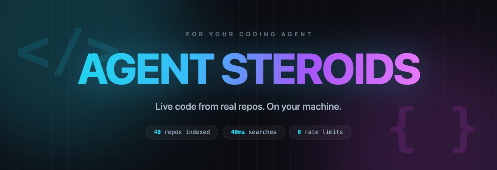

# 💉 Agent Steroids

<p align="center">
  
</p>

<p align="center">
  <strong>Live code from real repos, on your machine, for your coding agent.</strong>
</p>

<p align="center">
  <a href="https://github.com/KenKaiii/agent-steroids"></a>
  <a href="https://www.rust-lang.org"></a>
  <a href="LICENSE"></a>
  <a href="https://youtube.com/@kenkaidoesai"></a>
  <a href="https://skool.com/kenkai"></a>
</p>

<p align="center">
  macOS · Linux · Windows. One command to <a href="#-get-it">install</a>. No runtime, no daemon, no MCP server.
</p>

---

## 🧠 The problem nobody talks about

Your coding agent learned to code from a snapshot of the internet. That snapshot is old.

It does not matter which model you use. Claude, GPT, Gemini, all of them got trained on a pile of GitHub repos, and then that pile stopped moving. Meanwhile the actual libraries kept shipping. New APIs, new patterns, breaking changes, better ways of doing the thing.

So your agent writes code the way it was written a year ago, and sounds completely confident about it.

You can paste in docs. That helps a bit. But docs tell you what a thing is supposed to do, not how good engineers actually use it in a real project with real edge cases.

## 🚧 And the usual workaround is worse

There are tools that let an agent search public code through an API. They work, right up until you actually lean on them.

- **Rate limits.** Pull a few dozen samples and you are cut off.
- **Slow.** Every single search is a round trip to somebody else's server.
- **Not yours.** They pick what is searchable. The service goes down, so does your agent.

That is fine for looking something up once. It falls apart when your agent wants to check thirty different implementations before writing a function.

## ✅ What this does instead

You build your own library of code. Locally.

Pick the repos you care about. Building an AI framework? Grab fifty AI framework repos. Writing a payments integration? Grab the ones that already did it well. Then your agent searches all of it instantly, as many times as it likes, forever.

No rate limits. No waiting. No API keys. It is a file on your disk.

And because these are live repos, one command pulls the newest code down whenever you want. Your agent stops guessing from memory and starts reading what people are shipping right now.

## 🤯 The part that surprises people

It is tiny.

| | |
|---|---|
| 5 repos | **10 MB** |
| 40 repos | **145 MB** |
| Roughly | **2 to 4 MB per repo** |

We throw away about 90% of every repo before storing it. No images, no docs, no READMEs, no lock files, no bundled dependencies. Just the code worth learning from, squeezed down hard.

Those 40 repos were 382 MB of source. The code stores as 94 MB, and the rest is the search index that makes lookups instant.

Searches come back in **under 10 milliseconds** using about **8 MB of memory**. You could keep the whole thing on a USB stick and carry it between machines.

## ⚡ Against the hosted alternatives

Same searches, run against tools that query public code over an API:

| | Agent Steroids | Hosted code search |
|---|---|---|
| A search | **0.005s to 0.009s** | 2s to 40s |
| Rate limit | none | hit within minutes |
| Works offline | yes | no |
| Repos searched | the ones you chose | whatever they index |

Both measured the same way, on the same queries. Ours never left 9ms. Theirs
usually came back in a couple of seconds, but a quarter of the queries took
**25 to 42 seconds**, and that is the part that hurts: you cannot tell in
advance which one you are getting.

Thirty lookups is under a second here. Over there it is somewhere between a
minute and twenty, if you do not get rate limited first.

That rate limit matters more than the speed. Lean on a hosted tool for a few
minutes and it starts refusing you. Fine when you look something up once. Not
fine when your agent wants thirty samples before writing a function, which is
exactly what you want it doing.

## 🚀 Get it

You need [Rust](https://rustup.rs) installed. Then:

```bash
cargo install --git https://github.com/KenKaiii/agent-steroids
```

That gives you a `steroids` command that works from anywhere. Your library lives in `~/.steroids`.

## 🤖 Just let your agent do it

Honestly, the easiest way to use this is to not use it yourself. Paste this to [GG Coder](https://github.com/KenKaiii/gg-framework), Claude Code, Cursor, Codex, whatever you run:

```
Install Agent Steroids for me: https://github.com/KenKaiii/agent-steroids

Then look at what I am building and curate a corpus for it:
  - Use `steroids discover` to find well starred, actively maintained repos
    that solve similar problems
  - Index around 20 of them, then run `steroids index`
  - Show me what you added and how much space it used

From then on keep it fresh: run `steroids update` when I ask, and suggest new
repos whenever you hit a problem the current corpus does not cover.
```

That is it. It reads the README, installs it, works out what is relevant to your project, and fills your library.

Then add this to your agent's permanent instructions (`CLAUDE.md`, `.cursorrules`, or wherever your tool keeps them) so it actually keeps using it:

```
I have a local corpus of real open source code at ~/.steroids. Search it
before writing anything non-trivial, to see how other projects solved the
same problem.

  steroids search '<regex>' [--tag T] [--repo R] [--language L] [--limit N]
  steroids define <Symbol>       where something is defined
  steroids show <repo> <path>    read a full file
  steroids repos                 what is indexed
  steroids recent --tag X        what changed upstream in the last 72 hours

Add --json to search, define or repos for structured output.

If a search says the topic is not covered, that is a gap in my corpus, not a
bad query. Do not retry variations. Instead: run `steroids discover` to find
well starred, actively maintained repos that solve the problem, tell me what
you found and why it fits, and add them once I agree.
```

Now when you ask for a rate limiter, it goes and reads four real implementations first instead of recalling one from training.

There is no plugin and no server to run. Your agent just calls the command, same as it calls `grep`.

Results are spread across different repos on purpose, so the agent sees four projects' takes side by side instead of four files from one project. Every snippet is labelled with the function it came from, so it can skip the irrelevant ones without opening anything.

When nothing matches, it says why, and hands over the commands to fix it:

```
No code for 'swift_actor_isolation' in this corpus. Corpus holds 592 repositories.

This is a gap in what is indexed, not a bad search, so do not retry variations.
Fill the gap instead:
  1. Find candidates:  steroids discover '<topic or language>' --limit 20
  2. Tell the user what you found and why it fits their project
  3. With their go-ahead: steroids add <repos> --tag <label> && steroids index
  4. Re-run this search
```

So instead of your agent shrugging, it comes back with "I have nothing on this,
but I found five well maintained projects that do, shall I index them?" The
corpus grows into whatever you are actually building.

`search`, `define` and `repos` all take `--json` if you want machine-readable output.

## 📦 The starter pack

Do not want to pick repos yourself? This repo ships a curated list of around
500 widely used, actively maintained projects:

```bash
curl -O https://raw.githubusercontent.com/KenKaiii/agent-steroids/main/starter-repos.txt
steroids add --from-file starter-repos.txt
steroids index
```

Thirty categories: TypeScript, Python, Rust, Go, React, Next.js, Vue, Svelte,
Tailwind, AI agents, LLM tooling, RAG, MCP, databases, DevOps, testing,
security, mobile, game dev, and more. Every entry was checked against GitHub
when the list was built: not archived, not a fork, committed to within the last
year, and well starred. No awesome-lists, no tutorials, no books, just code.

Measured on the full list: **480 repos, 800,000 files, 1.8 GB**, about 25
minutes to fetch and 2 minutes to index. Searches stay around a quarter of a
second.

That is a lot for a first run. The file is grouped by category with comments,
so open it and delete the sections you do not care about. One section is closer
to 100 MB and a couple of minutes.

## 📚 Filling it yourself

If you would rather drive it manually:

```bash
steroids add openai/openai-agents-python crewAIInc/crewAI
steroids index
```

Pasting a GitHub URL works too. And you can hand it a text file of hundreds of repos:

```bash
steroids add --from-file repos.txt
```

Not sure what to add? Let it go find things:

```bash
steroids discover 'topic:ai-agents language:python' --add
steroids discover --trending --days 7 --language rust --add
```

## 🖥️ Have a look around

```bash
steroids
```

Run it with nothing after it and you get a proper interface. Browse your repos, open any file, search as you type with results appearing live. Arrow keys to move, `esc` to go back, `q` to quit. Press `a` to add a repo, `d` to remove one, `u` to refresh everything.

Downloads run in the background, so it never freezes on you.

## 🏷️ Categories

Label repos so you can work with a slice of the corpus:

```bash
steroids add --tag coding-agent openai/codex sst/opencode
steroids tag --add rust,cli sharkdp/fd BurntSushi/ripgrep
steroids tag                          # what tags exist
steroids repos --tag coding-agent     # what is in one
```

The starter list is grouped by category already, so you can tag the whole thing
in one pass from its section headers.

## 🔭 What changed this week

An indexed corpus is a snapshot. This is the other question: what have these
projects actually done lately?

```bash
steroids recent --tag coding-agent --hours 72
steroids recent --repo openai/codex --hours 24
steroids recent --hours 24 --limit 20        # everything
```

```
2026-09-01T01:49  bytedance/deer-flow    he-yufeng   fix(security): sanitize MCP-sourced tool results
2026-09-01T01:38  stablyai/orca          nwparker    perf(relay): cache process-table descendant indexes
```

Useful when you are building in a field that moves weekly. Your agent can read
what a dozen similar projects changed in the last three days, then apply the
same fix or pattern to yours before it is written up anywhere.

This reads commit feeds rather than the API, so it is not rate limited and
needs no token. Checking all 485 repositories takes about 30 seconds; one tag
is under 2 seconds. Add `--json` for structured output.

## 🧹 Keeping it fresh

```bash
steroids update      # pull the latest code for everything
steroids repos       # see what you have
steroids stats       # see what it costs you
```

`update` checks each repo's latest commit first and only downloads the ones
that actually moved, so running it daily on a big corpus costs almost nothing.
Measured on 485 repositories: **2m50s**, of which 465 were already current and
skipped entirely. No API quota is used, so there is no limit on how many repos
you update or how often.
Adding a repo you already have is skipped too, whether you paste the name or
the full URL.

Repos go quiet. You can have those cleaned out automatically:

```bash
steroids config decay_months 6
steroids decay --dry-run
steroids decay
```

That measures from the repo's **last commit**, not from when it was created or
when you added it. A library first published in 2011 but committed to yesterday
counts as fresh; one started last year and then abandoned does not.

Repos the owner has archived are dropped whatever their age, since an archive
is frozen upstream and will never get another fix. That happens even with
`decay_months` at 0, and discovery never suggests them in the first place.

Dry run first, always.

## ⚙️ All the settings

```bash
steroids config                  # show everything
steroids config min_stars 500    # change one
```

| Setting | Default | What it does |
|---|---|---|
| `decay_months` | `0` | Drop repos with no commits in N months. 0 means never |
| `decay_archived` | `true` | Also drop repos the owner has archived |
| `auto_discover` | `false` | Top up with new repos on every update |
| `discover_query` | `topic:ai-agents` | What to look for when discovering |
| `discover_limit` | `25` | Cap on how many one discovery run adds |
| `min_stars` | `500` | Skip anything below this |
| `max_age_months` | `24` | Skip repos with no commits in N months. 0 accepts any age |

Settings live inside the library itself, so they travel with it.

## 💾 Taking it with you

The whole thing is one folder. Copy it to an external drive and point at it:

```bash
STEROIDS_ROOT=/Volumes/MyDrive/steroids steroids search 'retry'
```

Same on any machine. Nothing else to set up.

---

## 👨‍💻 For devs

Rust 1.88 or newer. No other dependencies, no runtime, no daemon.

```bash
git clone https://github.com/KenKaiii/agent-steroids.git
cd agent-steroids
cargo install --path .
```

```bash
cargo test --release                       # engine and unit tests
bash tests/commands.sh                     # every command, including failures
cargo clippy --release --all-targets -- -D warnings
cargo fmt
```

`tests/commands.sh` runs each command an agent can call and asserts on both the
output and the exit code, since a command that prints an error and exits 0
looks like success to whatever called it. It needs network access.

Some tests need a populated corpus and skip without one. Point them at yours:

```bash
STEROIDS_TEST_ROOT=~/.steroids cargo test --release
```

**How it works.** Repos come down as tarballs straight from codeload, which has no rate limit, so a 500 repo ingest is capped by your bandwidth and nothing else. Files are filtered while the download is still streaming, so the full repo never lands on disk. What survives gets compressed against a shared zstd dictionary trained on your own corpus. Search narrows candidates with a non-positional trigram index, then confirms each hit with a real regex, which is why the index costs a fraction of what a normal one would.

**Gitee.** References can be prefixed `gitee:owner/name`, and the plumbing
works: Gitee uses the same archive layout and the same git protocol. In
practice ingest usually fails from outside China, because Gitee answers archive
requests with a captcha page unless it recognises the client. Getting past that
would mean impersonating another tool to evade their bot check, so the request
is made honestly and the failure reported.

`add`, `update` and `decay` make no GitHub API calls at all. Code comes from
codeload, the head commit from git's own protocol, and the last-commit date out
of the archive's file timestamps. None of those are rate limited, so updating
hundreds of repositories costs nothing and needs no account.

`discover` is the one exception: searching GitHub needs the search API, which
allows 10 requests a minute without a token. Set `GITHUB_TOKEN` to raise it.

```
src/filters.rs  what earns disk space
src/fetch.rs    tarball download and filtering
src/bulk.rs     parallel ingest
src/store.rs    compressed content store (sqlite + blobs.bin)
src/index.rs    trigram index
src/search.rs   query: narrow by trigram, verify by regex
src/tui/        the interactive browser
```

No GitHub account is needed for anything except `discover`, and even there `GITHUB_TOKEN` only raises how often you can run it.

---

## 📄 Licence

MIT. Use it, change it, ship it, sell it. Just keep the copyright notice.

---

## 👥 Come hang out

- [YouTube @kenkaidoesai](https://youtube.com/@kenkaidoesai), tutorials and demos
- [Skool community](https://skool.com/kenkai)

---

<p align="center">
  <strong>Your agent stops guessing. It reads what actually shipped.</strong>
</p>
